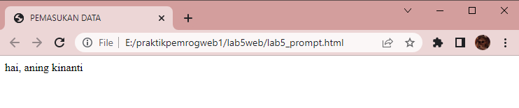
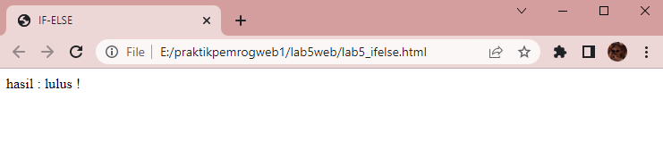
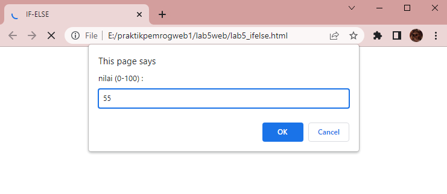
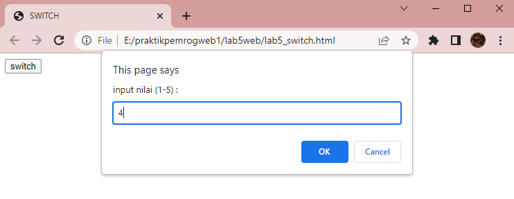
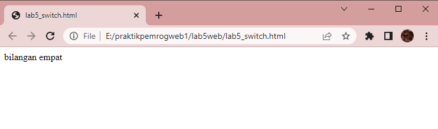
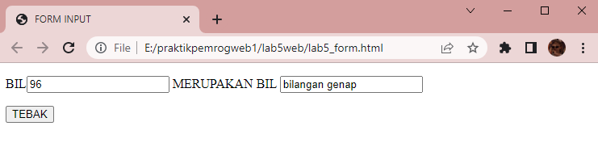
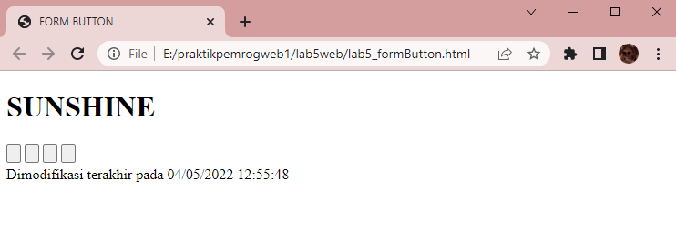

# Web5Lab5

**Nama    : Aning Kinanti** <br>
**NIM     : 312010364** <br>
**Kelas   : TI.20.A2** <br>
**Matkul  : Pemrograman Web** <br>

# Belajar Javascript

## A. Pengenalan Javascript
### 1. Membuat File HTML
Buatlah dokumen HTML dengan nama lab5_javascript.html seperti contoh dibawah ini : <br>
```
    <!DOCTYPE html>
    <html lang="en">
    <head>
        <meta charset="UTF-8">
        <meta http-equiv="X-UA-Compatible" content="IE=edge">
        <meta name="viewport" content="width=device-width, initial-scale=1.0">
        <title>MENGENAL JAVASCRIPT</title>
    </head>
    <body>
        <h1>Pengenalan JavaScript</h1>
        <h3>Contoh document.write dan console.log</h3>
        <script>
            document.write("Hello Sunshine !");
            console.log("Hello World !");
        </script>
    </body>
    </html>
```
<br>


Ini adalah hasil dari sintaks diatas :
 <br>

## B. Javascript Dasar
### 1. Membuat Alert
Membuat alert sebagai property window menggunakan `window.alert()` seperti contoh dibawah ini : <br>
```
    <!DOCTYPE html>
    <html lang="en">
    <head>
        <meta charset="UTF-8">
        <meta http-equiv="X-UA-Compatible" content="IE=edge">
        <meta name="viewport" content="width=device-width, initial-scale=1.0">
        <title>ALERT BOX</title>
    </head>
    <body>
        <script language = "Javascript">
            window.alert ("Ini pesan untuk anda");
        </script>
    </body>
    </html>
```
<br>


Ini adalah hasil dari sintaks diatas :
 <br>

### 2. Penggunaan Method
Cara penggunaan method dalam objek menggunakan `document.write()` seperti contoh dibawah ini : <br>
```
    <!DOCTYPE html>
    <html lang="en">
    <head>
        <meta charset="UTF-8">
        <meta http-equiv="X-UA-Compatible" content="IE=edge">
        <meta name="viewport" content="width=device-width, initial-scale=1.0">
        <title>SKRIP JAVASCRIPT</title>
    </head>
    <body>
        percobaan memakai javascript : <br>
        <script language = "javascript" type="text/javascript">
            document.write("Selamat Belajar Javascript");
            document.write("<br>");
            document.write("GoodLuck !");
        </script>
    </body>
    </html>
```
<br>


Ini adalah hasil dari sintaks diatas :
 <br>

### 3. Penggunaan Prompt
Cara penggunaan prompt seperti contoh dibawah ini : <br>
```
    <!DOCTYPE html>
    <html lang="en">
    <head>
        <meta charset="UTF-8">
        <meta http-equiv="X-UA-Compatible" content="IE=edge">
        <meta name="viewport" content="width=device-width, initial-scale=1.0">
        <title>PEMASUKAN DATA</title>
    </head>
    <body>
        <script language="javascript">
            var nama = prompt("Siapa nama anda ?", "Masukan nama anda");
            document.write("hai, " + nama);
        </script>
    </body>
    </html>
```
<br>


Ini adalah hasil awal dari sintaks diatas : <br>
 <br>

Masukan nama contoh seperti dibawah ini : <br>
 <br>

Lalu klik tombol OK, maka akan menjadi seperti dibawah ini : <br>
 <br>

### 4. Penggunaan Javascript dengan Body Onload
Cara penggunaan javascript dengan body onload seperti contoh dibawah ini : <br>
```
    <!DOCTYPE html>
    <html lang="en">
    <head>
        <meta charset="UTF-8">
        <meta http-equiv="X-UA-Compatible" content="IE=edge">
        <meta name="viewport" content="width=device-width, initial-scale=1.0">
        <title>PENGGUNAAN ONLOAD</title>
        <script language="javascript">
            function pesan(){
                alert ("memanggil javascript lewat body onload")
            }
        </script>
    </head>
    <body>
        <body onload=pesan()>
    </body>
    </html>
```
<br>


Ini adalah hasil dari sintaks diatas : <br>
 <br>

## C. Dasar Pemrograman Pada Javascript
### 1. Operasi Dasar Aritmatika
Contoh operasi dasar aritmatika seperti contoh dibawah ini : <br>
```
    <!DOCTYPE html>
    <html lang="en">
    <head>
        <meta charset="UTF-8">
        <meta http-equiv="X-UA-Compatible" content="IE=edge">
        <meta name="viewport" content="width=device-width, initial-scale=1.0">
        <title>Operasi Dasar Aritmatika</title>
        <script language="javascript">
            function test (val1, val2) {
                document.write("<br>"+"Perkalian : val1*val2"+"<br>")
                document.write(val1*val2)
                document.write("<br>"+"Pembagian : val1/val2"+"<br>")
                document.write(val1/val2)
                document.write("<br>"+"Penjumlahan : val1+val2"+"<br>")
                document.write(val1+val2)
                document.write("<br>"+"Pengurangan : val1-val2"+"<br>")
                document.write(val1-val2)
                document.write("<br>"+"Modulus : val1%val2"+"<br>")
                document.write(val1%val2)
            }
        </script>
    </head>
    <body>
        <input type="button" name="button1" value="arithmetic" onclick=test(12,4)>
    </body>
    </html>
```
<br>


Ini adalah hasil awal dari sintaks diatas :
 <br>

Apabila button arithmatic diklik, maka akan muncul seperti dibawah ini :
 <br>

### 2. Penggunaan IF-ELSE
Cara penggunaan If-Else seperti contoh dibawah ini : <br>
Dengan konsep apabila nilai yang diinputkan sama dengan atau lebih dari 60, maka akan lulus. <br>
Sedangkan nilai dibawah 60, maka tidak lulus. <br>
```
    <!DOCTYPE html>
    <html lang="en">
    <head>
        <meta charset="UTF-8">
        <meta http-equiv="X-UA-Compatible" content="IE=edge">
        <meta name="viewport" content="width=device-width, initial-scale=1.0">
        <title>IF-ELSE</title>
    </head>
    <body>
        <script language="javascript">
            var nilai = prompt("nilai (0-100) : ", 0);
            var hasil = "";
            if (nilai >= 60)
            hasil = "lulus !";
            else
            hasil = "tidak lulus";
            document.write("hasil : "+hasil);
        </script>    
    </body>
    </html>
```
<br>


Ini adalah hasil awal dari sintaks diatas : <br>
Misalkan pada kolom input diisi 75 <br>
 <br>

Maka, akan muncul hasil seperti dibawah ini : <br>
 <br>

Lalu, dicoba lagi misalkan pada kolom input diisi 55 <br>
 <br>

Maka, akan muncul hasil seperti dibawah ini : <br>
 <br>

### 3. Penggunaan Switch
Cara penggunaan switch seperti contoh dibawah ini : <br>
Dengan konsep user diminta menginputkan nilai 1-5. Nilai yang diinputkan akan muncul sesuai case nya.<br>
```
    <!DOCTYPE html>
    <html lang="en">
    <head>
        <meta charset="UTF-8">
        <meta http-equiv="X-UA-Compatible" content="IE=edge">
        <meta name="viewport" content="width=device-width, initial-scale=1.0">
        <title>SWITCH</title>
        <script lang="javascript">
            function test()
            {
                val1=window.prompt("input nilai (1-5) : ")
                switch (val1)
                {
                    case "1" :
                        document.write("bilangan satu")
                        break
                    case "2" :
                        document.write("bilangan dua")
                        break
                    case "3" :
                        document.write("bilangan tiga")
                        break
                    case "4" :
                        document.write("bilangan empat")
                        break
                    case "5" :
                        document.write("bilangan lima")
                        break
                    default :
                        document.write("bilangan lainnya") 
                }
            }
        </script>
    </head>
    <body>
        <input type="button" name="button1" value="switch" onclick=test()>
    </body>
    </html>
```
<br>


Ini adalah hasil awal dari sintaks diatas : <br>
 <br>

Misalkan pada kolom input diisi 4  <br>
 <br>

Maka, akan muncul hasil seperti dibawah ini : <br>
 <br>

## D. Pembuatan Form
### 1. Membuat Form Input
Membuat form input seperti contoh dibawah ini : <br>
Dengan konsep menyatakan suatu bilangan yang akan diinputkan merupakan bilangan ganjil atau genap. <br>
```
    <!DOCTYPE html>
    <html lang="en">
    <head>
        <meta charset="UTF-8">
        <meta http-equiv="X-UA-Compatible" content="IE=edge">
        <meta name="viewport" content="width=device-width, initial-scale=1.0">
        <title>FORM INPUT</title>
        <script lang="javascript">
            function test() {
                var val1=document.kirim.T1.value
                if (val1%2==0)
                    document.kirim.T2.value="bilangan genap"
                else
                    document.kirim.T2.value="blangan ganjil"
            }
        </script>
    </head>
    <body>
        <form method="POST" name="kirim">
            <p>BIL<input type="text" name="T1" size="20"> MERUPAKAN BIL <input type="text" name="T2" size="20"></p>
            <p><input type="button" value="TEBAK" name="B1" onclick=test()></p>
        </form>
    </body>
    </html>
```
<br>


Ini adalah hasil awal dari sintaks diatas : <br>
Misalkan pada kolom input BIL diisi nilai 96  <br>
 <br>

Lalu, klik button TEBAK. <br>
Maka, akan muncul hasil seperti dibawah ini : <br>
Yaitu 96 merupakan bilangan genap. <br>
 <br>

### 2. Membuat Form Button
Membuat form button seperti contoh dibawah ini : <br>
Button yang diklik nantinya dapat merubah warna background atau warna font. <br>
```
    <!DOCTYPE html>
    <html lang="en">
    <head>
        <meta charset="UTF-8">
        <meta http-equiv="X-UA-Compatible" content="IE=edge">
        <meta name="viewport" content="width=device-width, initial-scale=1.0">
        <title>FORM BUTTON</title>
    </head>
    <body>
        <script lang="javascript">
            function ubahWarnaLB(warna) {
                document.bgColor = warna;
            }
            function ubahWarnaLD(warna) {
                document.fgColor = warna;
            }
        </script>

        <h1>SUNSHINE</h1>
        <form>
            <input type="button" name="Latar Belakang Hijau" onclick="ubahWarnaLB('GREEN')">
            <input type="button" name="Latar Belakang Oren" onclick="ubahWarnaLB('ORANGE')">
            <input type="button" name="Teks Kuning" onclick="ubahWarnaLD('YELLOW')">
            <input type="button" name="Teks Biru" onclick="ubahWarnaLD('BLUE')">
        </form>
        <script lang="javascript">
            document.write("Dimodifikasi terakhir pada " + document.lastModified);
        </script>
    </body>
    </html>
```
<br>


Ini adalah hasil awal dari sintaks diatas : <br>
 <br>

Button ke 1 dan 2 akan merubah warna background, sedangkan buttton ke 3 dan 4 akan merubah warna font. <br>
Apabila button ke 1 dan 3 diklik maka akan berubah seperti dibawah ini.<br>
 <br>

Apabila button ke 2 dan 4 diklik maka akan berubah seperti dibawah ini.<br>
 <br>

## E. HTML DOM
### 1. Membuat Daftar Menu
Membuat daftar menu seperti contoh dibawah ini : <br>
Memakai sistem pilihan menggunakan checkbox dengan perhitungan otomatis <br>
```
    <!DOCTYPE html>
    <html lang="en">
    <head>
        <meta charset="UTF-8">
        <meta http-equiv="X-UA-Compatible" content="IE=edge">
        <meta name="viewport" content="width=device-width, initial-scale=1.0">
        <title>DAFTAR MENU</title>
        <script>
            function hitung(ele) {
                var total = document.getElementById('total').value;
                    total = (total ? parseInt(total) : 0);
                var harga = 0;

                if (ele.checked) {
                    harga = ele.value;
                    total += parseInt(harga);
                } else {
                    harga = ele.value;
                    if (total > 0)
                        total -= parseInt(harga);
                }
                document.getElementById('total').value = total;
            }
        </script>
    </head>
    <body>
        <h1>Daftar Menu Makanan</h1>
        <label><input type="checkbox" value="5000" id="menu1" onclick="hitung(this);"/>Ayam Goreng Rp.5000</label></br>
        <label><input type="checkbox" value="500" id="menu2" onclick="hitung(this);"/>Tempe Goreng Rp.500</label></br>
        <label><input type="checkbox" value="2500" id="menu2" onclick="hitung(this);"/>Telur Dadar Rp.2500</label></br>
        <strong>Total Bayar : Rp. <input id="total" type="text"></strong>
    </body>
    </html>
```
<br>


Ini adalah hasil awal dari sintaks diatas : <br>
 <br>

Apabila checkbox ke 1 dan ke 3 diceklis, maka akan menghitung otomatis total harga seperti dibawah ini. <br>
 <br>


## SOAL

### Pertanyaan dan Tugas

### 1. Buat script untuk melakukan validasi pada isian form. <br>
Jawab : <br>
